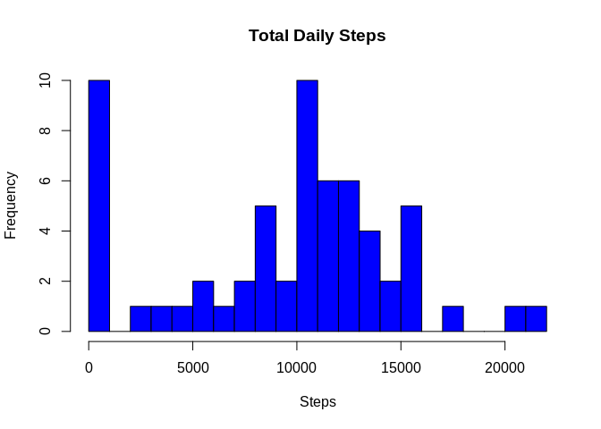
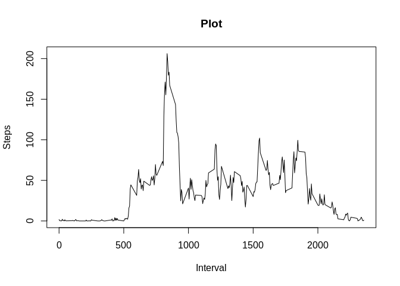
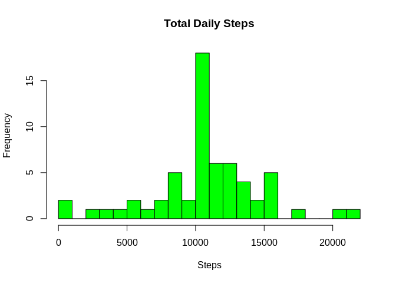
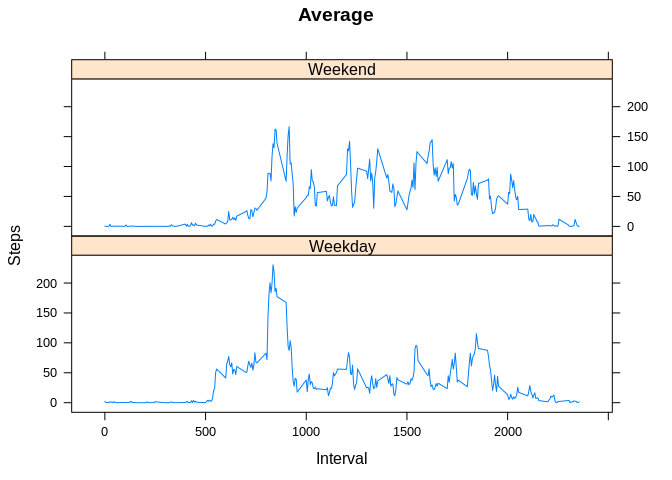

## Loading and preprocessing the data
####1. Load the data

```r
activity <- read.csv("activity.csv")
```

####2. Process data

```r
clean_activity <- subset(activity, !is.na(activity$steps))
```

## What is mean total number of steps taken per day?
####1. Calculate the total number of steps taken per day 

```r
number_of_steps_day <- with(activity, aggregate(steps, by = list(date), FUN = sum, na.rm = TRUE))
colnames(number_of_steps_day) <- c("Date", "Steps")
```

####2. Make a histogram of the total number of steps taken each day

```r
hist(x=number_of_steps_day$Steps, col = "blue", breaks = 20, xlab = "Steps", ylab = "Frequency", main = "Total Daily Steps")
```

<!-- -->

####3.Calculate and report the mean and median of the total number of steps taken per day

```r
non_imputed_mean <- mean(number_of_steps_day$Steps)
non_imputed_meadian <- median(number_of_steps_day$Steps)
```

## What is the average daily activity pattern?
####1.Make a time series plot (i.e. \color{red}{\verb|type = "l"|}type="l") of the 5-minute interval (x-axis) and the average number of steps taken, averaged across all days (y-axis)

```r
steps_by_interval <- with(activity, aggregate(steps, by = list(interval), FUN = mean, na.rm = TRUE))
colnames(steps_by_interval) <- c("Interval", "Steps")
plot(steps_by_interval$Interval, steps_by_interval$Steps, type = "l", xlab = "Interval", ylab = "Steps", main="Plot")
```

<!-- -->

####2. Which 5-minute interval, on average across all the days in the dataset, contains the maximum number of steps?

```r
maximum_interval <- steps_by_interval[which.max(steps_by_interval$Steps),1]
```
## Imputing missing values
####1.Calculate and report the total number of missing values in the dataset (i.e. the total number of rows with \color{red}{\verb|NA|}NAs)

```r
missing_values <- sum(is.na(activity$steps))
```
#2. Devise a strategy for filling in all of the missing values in the dataset. 
#### Missing values need to be imputed by inserting the average of each interval
####3. Create a new dataset that is equal to the original dataset but with the missing data filled in

```r
missing_values <- is.na(activity$steps)
interval_avg <- tapply(clean_activity$steps, clean_activity$interval, mean, na.rm=TRUE, simplify = T)
activity_impute <- activity
activity_impute$steps[missing_values] <- interval_avg[as.character(activity_impute$interval[missing_values])]
```
####4. Make a histogram of the total number of steps taken each day and Calculate and report the mean and median total number of steps taken per day.

```r
new_steps_by_int <-  aggregate(steps ~ date, activity_impute, sum)
hist(x=new_steps_by_int$steps, col="green", breaks=20, xlab = "Steps", ylab = "Frequency", main = "Total Daily Steps")
```

<!-- -->

```r
imputed_mean <- mean(new_steps_by_int$steps)
imputed_meadian <- median(new_steps_by_int$steps)
```
####Do these values differ from the estimates from the first part of the assignment? What is the impact of imputing missing data on the estimates of the total daily number of steps?
#####Imputing missing data have only a little and transcurable impact on the mean ant the median of the total daily number of steps.

#####Different methods for replace missing values could cause different results.

## Are there differences in activity patterns between weekdays and weekends?
####1. Create a new factor variable in the dataset with two levels – “weekday” and “weekend” indicating whether a given date is a weekday or weekend day.

```r
weekdays <- c("Monday", "Tuesday", "Wednesday", "Thursday", "Friday")
activity_impute$day_of_week = as.factor(ifelse(is.element(weekdays(as.Date(activity_impute$date)),weekdays), "Weekday", "Weekend"))
```
####2.Make a panel plot containing a time series plot (i.e. \color{red}{\verb|type = "l"|}type="l") of the 5-minute interval (x-axis) and the average number of steps taken, averaged across all weekday days or weekend days (y-axis). 
weekday or weekend day.

```r
steps_by_interval_wd <- aggregate(steps ~ interval + day_of_week, activity_impute, mean)
library(lattice)
xyplot(steps_by_interval_wd$steps ~ steps_by_interval_wd$interval|steps_by_interval_wd$day_of_week, main = "Average", xlab = "Interval", ylab = "Steps", layout=c(1, 2), type="l")
```

<!-- -->
